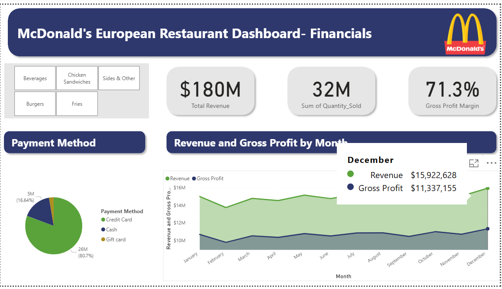
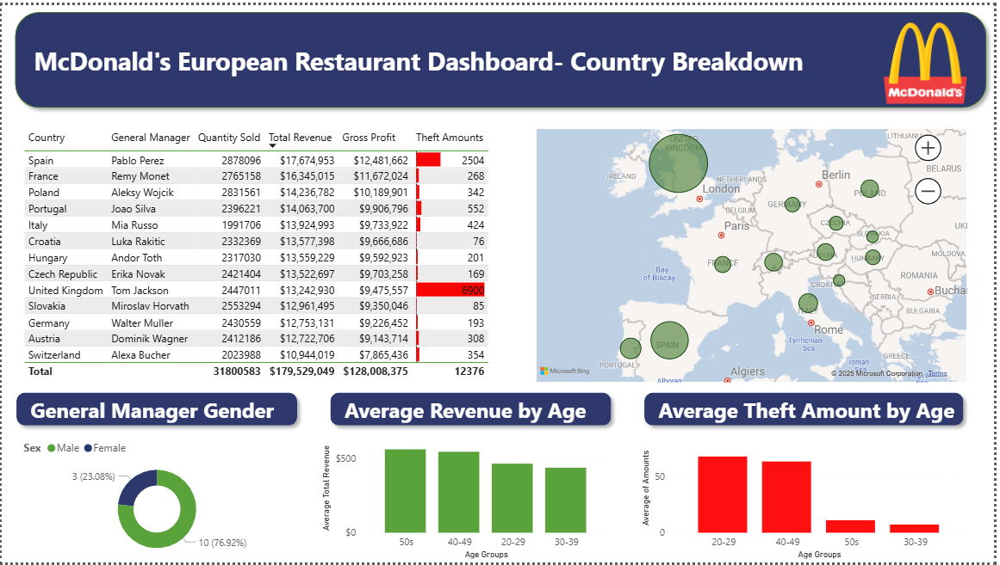

# McDonalds-Dashboard-
Power BI dashboard analyzing franchise sales data across countries as well as manager demographics, tracking revenue, costs, and profit.

**Tools Used:**  
Power BI, Power Query, DAX

**Goal:**  
Provide franchise managers with a clear, interactive view of revenue, costs, and profits at both country and regional levels.

**Process:**  
- Cleaned and transformed data in Power Query.  
- Created calculated measures in DAX to track key metrics.  
- Built interactive dashboard with slicers, KPIs, and custom visuals.

**Outcome / Insights:**  
- Highlighted top-performing products, locations, regions, and managers.  
- Improved visibility into revenue trends, top selling products, demographic data, and margin performance for data-driven decision-making.

**Preview:**  
  

**Full Project File:**  
[MCD Dashboard.pbix)

